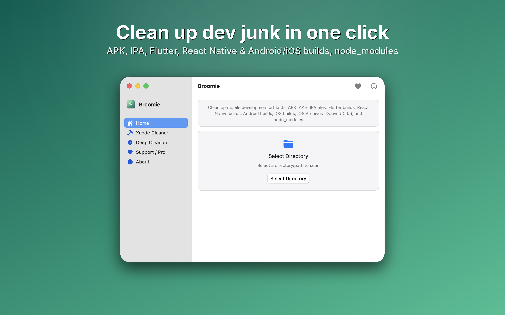
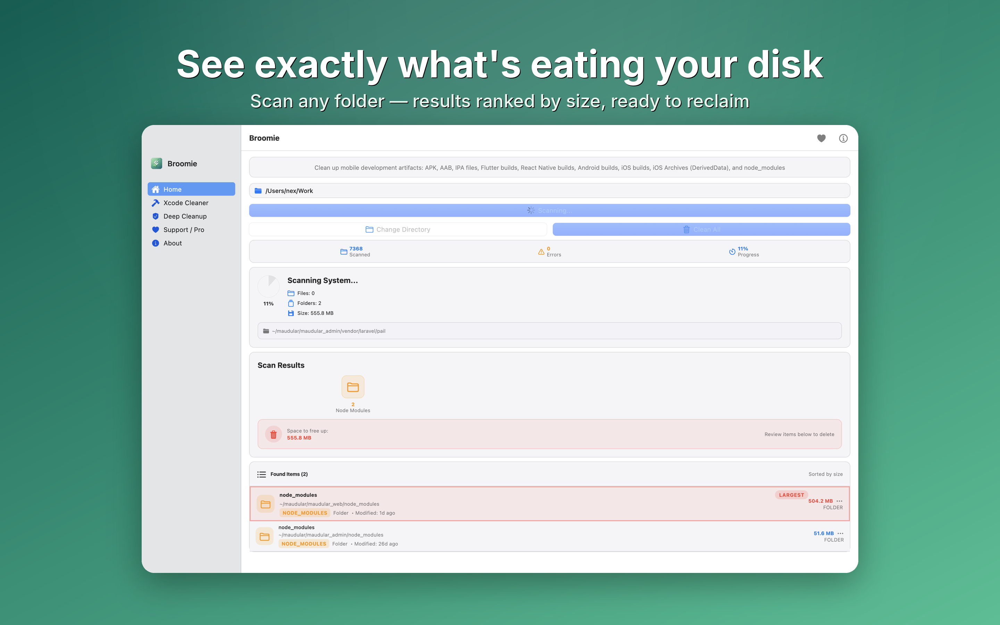
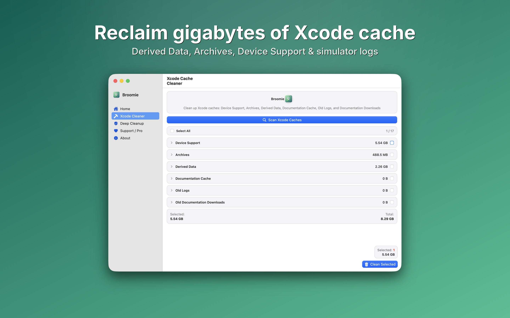
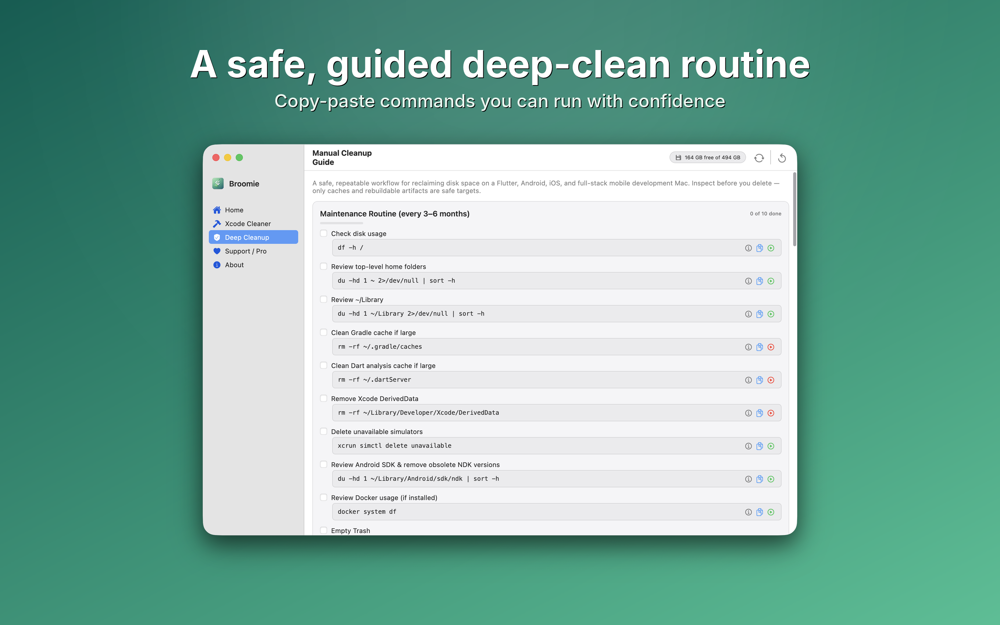
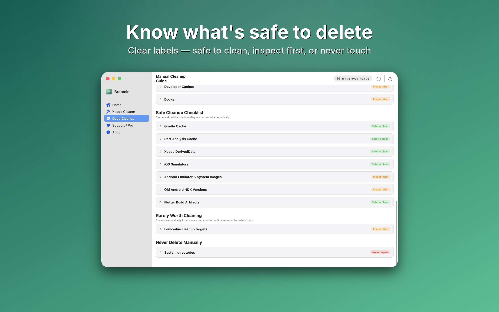

# MacOS Broomie - Mobile Development Artifact Cleaner

## 📥 Download Broomie

<div>

[](https://apps.apple.com/us/app/broomie-appbuild-dev-cleaner/id6755060683?mt=12)

[](https://raw.githubusercontent.com/iamnabink/flutter-build-cleaner-mac/main/Broomie.dmg)

**✅ Safety & Security Assurance:**
- 🔒 **Code-Signed** - The DMG file is signed with an Apple Developer ID Application certificate
- ✅ **Notarized by Apple** - The app has been notarized by Apple, ensuring it's free of malware
- 🛡️ **100% Safe** - No security warnings, no malware, completely safe to install
- ✨ **Verified** - The app bundle and DMG are both signed and verified

**Quick Install:**

**Option 1 - Mac App Store (Recommended):**
1. Click the "Download on the Mac App Store" button above
2. Install directly from the App Store
3. Launch from Applications or Spotlight

**Option 2 - Direct Download (DMG):**
1. Click the "Download Broomie.dmg" button above
2. Open the downloaded DMG file
3. Drag **Broomie** to your Applications folder
4. Launch from Applications - **No security warnings!**

---

</div>

<div align="center">
  
  
  
  
  
</div>

A powerful macOS desktop application built with Flutter that helps mobile developers clean up unnecessary build artifacts from their system to free up disk space.

## Why I Built This App

As a mobile developer working with Flutter and React Native, I constantly faced the problem of **massive build artifacts consuming gigabytes of disk space**. This app automatically scans your system, identifies build artifacts, and safely removes them to free up space.

### The Problem
- **Flutter builds** accumulate quickly across multiple projects
- **React Native node_modules** folders grow to hundreds of MBs each
- **iOS Archives** in DerivedData can reach several GBs
- **Android APK/AAB files** pile up in build folders
- **Manual cleanup** is tedious and error-prone

### The Solution
Broomie automatically scans, identifies, and safely removes build artifacts (never source code), saving hours of manual cleanup work.

## Installation

**From Mac App Store (Recommended):**
1. Click the "Download on the Mac App Store" button at the top
2. Install directly from the App Store
3. Launch from Applications or Spotlight
4. **Grant permission** when prompted to access your home directory

**Direct Download (DMG):**
1. **Download the latest DMG** from the [Releases](https://github.com/iamnabink/flutter-build-cleaner-mac/releases) page or click the DMG download button at the top
2. **Open the DMG file** and drag **Broomie** to your Applications folder
3. **Launch** from Applications or Spotlight
4. **Grant permission** when prompted to access your home directory

## What It Cleans

- **APK/AAB/IPA files** (Android/iOS packages)
- **Flutter build folders** (`build/` directories)
- **React Native build folders** (`android/app/build/`, `ios/build/`)
- **iOS Archives** (DerivedData `.xcarchive` files)
- **node_modules folders** (React Native dependencies)

## Safety Features

- ✅ **Never deletes source code** - Only targets build artifacts
- ✅ **Skips system directories** - Protects important system files
- ✅ **Preview before delete** - See exactly what will be removed
- ✅ **Open in Finder** - Right-click any item to inspect it

## System Requirements

- **macOS 10.15** or later
- **50MB** free disk space for the app
- **File system access** permission (granted on first launch)

---

## Building from Source

```bash
git clone https://github.com/iamnabink/macOs-mobile-dev-cleaner.git
cd macOs-mobile-dev-cleaner

# REQUIRED: create your local .env (the build fails without it — it's a bundled asset)
cp .env.example .env

flutter pub get
flutter run -d macos
```

**About `.env`:** the only variable is `REVENUECAT_API_KEY` (RevenueCat public
SDK key for in-app purchases). **Leave it empty** — the app runs fully
featured with the Pro/paywall UI hidden. Never commit your `.env`.

The UI is built entirely with [macos_ui](https://pub.dev/packages/macos_ui).
See [CLAUDE.md](CLAUDE.md) for architecture notes and conventions.

---

## Releasing

Both distribution channels are built by
[`.github/workflows/release.yml`](.github/workflows/release.yml) from a single
tag — no manual signing, notarizing or uploading.

```bash
git tag v9.0.1
git push origin v9.0.1
```

| Job | Produces | Goes to |
| --- | --- | --- |
| `testflight` | signed `.pkg` | App Store Connect → TestFlight → Mac App Store |
| `dmg` | signed + notarized `.dmg` | GitHub Release |

To build without publishing, run the workflow manually
(Actions → Release → Run workflow). Artifacts attach to the run; the GitHub
Release and the store upload are skipped.

**Bump the version first** — both stores reject a re-used build number:

```yaml
# pubspec.yaml
version: 9.0.1+13
```

### How signing works

Two different Apple credentials, for two different purposes:

- **Mac App Store** — the archive is signed with an *Apple Distribution*
  certificate and a Mac App Store provisioning profile, both created on demand
  by Xcode cloud signing (`-allowProvisioningUpdates` authenticated with the
  App Store Connect API key). Nothing has to exist on the machine beforehand.
- **Direct download** — the app is signed with a *Developer ID Application*
  certificate (hardened runtime, `--options runtime`), then notarized by Apple
  and stapled, so Gatekeeper opens it offline with no warning. The `.dmg` is
  signed and notarized separately from the `.app` inside it.

Notarization uses the same App Store Connect API key as the upload, so no Apple
ID or app-specific password is involved.

### Required secrets

Stored in the `secrets` **environment** (Settings → Environments → secrets),
which each job declares with `environment: secrets`.

| Secret | Used by |
| --- | --- |
| `ASC_KEY_P8` | both — base64 of the App Store Connect `.p8` key |
| `ASC_KEY_ID` | both |
| `ASC_ISSUER_ID` | both |
| `APPLE_TEAM_ID` | both |
| `REVENUECAT_API_KEY` | both — see below |
| `MACOS_CERTIFICATE` | dmg — base64 of the Developer ID `.p12` |
| `MACOS_CERTIFICATE_PWD` | dmg |
| `KEYCHAIN_PASSWORD` | dmg, optional (throwaway CI keychain) |

> [!IMPORTANT]
> `.env` is a **declared asset** in `pubspec.yaml` but is gitignored, so CI must
> recreate it or the build fails outright with
> `No file or variants found for asset: .env`. That is what
> `REVENUECAT_API_KEY` is for. Leave the secret empty to ship without in-app
> purchases — the Pro/paywall UI hides itself (see `lib/config/env.dart`).
>
> The RevenueCat *public SDK key* ships inside the app bundle by design, like a
> Firebase API key. The secret keeps it out of this public repo's history, not
> out of the binary.

> [!WARNING]
> When exporting the Developer ID `.p12`, export **only that identity** and
> **include its private key**. Exporting "all identities" from a shared login
> keychain also exports every other developer's private key.

### Releasing locally

`./create_dmg.sh` still builds, signs and notarizes a DMG from your Mac using
`notarization.config` (gitignored: `APPLE_ID`, `APPLE_APP_PASSWORD`,
`TEAM_ID`). CI is the normal path; the script is there for testing the pipeline
without cutting a tag.

## Contributing

We welcome contributions! Please read our [Contributing Guidelines](CONTRIBUTING.md) before submitting a pull request.

**Found a bug or have a feature request?**
- 🐛 [Report a Bug](https://github.com/iamnabink/macOs-mobile-dev-cleaner/issues/new?template=bug_report.md)
- ✨ [Request a Feature](https://github.com/iamnabink/macOs-mobile-dev-cleaner/issues/new?template=feature_request.md)
- 📖 [Documentation Issue](https://github.com/iamnabink/macOs-mobile-dev-cleaner/issues/new?template=documentation.md)

**Quick Start:**
1. Fork the repository
2. Create a feature branch (`git checkout -b feat/amazing-feature`)
3. Make your changes
4. Commit with clear messages (`git commit -m 'feat: add amazing feature'`)
5. Push to your branch (`git push origin feat/amazing-feature`)
6. Open a Pull Request

For detailed information about our development workflow, code standards, and PR process, see [CONTRIBUTING.md](CONTRIBUTING.md).

---

## Made With Love

**Broomie** was created by **Nabraj Khadka** - Mobile Developer & Flutter Enthusiast

**Connect with me:**
- 🔗 [LinkedIn](https://linkedin.com/in/iamnabink)
- 💻 [GitHub](https://github.com/iamnabink)

*Building tools that make developers' lives easier, one app at a time!* ✨

---

**Version 6.0.0 • Build 6**

*Free up your disk space and focus on what matters - building amazing mobile apps!* 🚀
