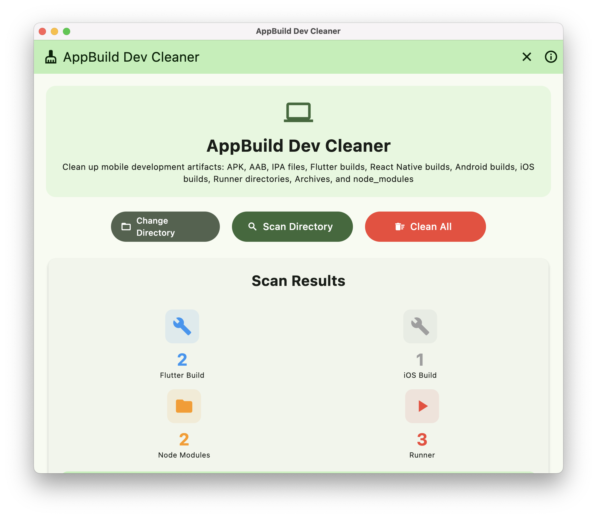

# Flutter Build Cleaner for macOS



A powerful macOS desktop application built with Flutter that helps you find and remove unnecessary APK files, AAB files, and Flutter build folders from your system to free up disk space.

Flutter Build Cleaner is a macOS utility designed specifically for Flutter developers. When working on multiple Flutter projects, build files quickly accumulate across apps and consume large amounts of storage. Developers often forget to run flutter clean or lose track of where these build artifacts are located. Flutter Build Cleaner scans your system, finds all build directories across your Flutter apps, shows how much space they occupy, and lets you clean them up easily, helping you reclaim valuable disk space with just a few clicks.


## 🚀 Features

- **🔍 Smart Scanning**: Recursively scans directories for APK, AAB files and Flutter build folders
- **📊 Real-time Progress**: Live updates with progress percentage, file counts, and sizes
- **🎨 Beautiful UI**: Modern Material 3 design with smooth animations
- **🔐 Permission Handling**: Native macOS file access with system permission dialogs
- **📈 Size Analysis**: Automatically highlights largest files and shows total space to free
- **⚡ Async Operations**: Non-blocking scanning and deletion with progress indicators
- **🛡️ Safe Operations**: Confirmation dialogs and error handling for all file operations
- **📱 Responsive Design**: Optimized for macOS desktop with proper window sizing

## 📦 Installation Options

### Option 1: Download DMG (Recommended)

1. **Download the latest DMG** from the [Releases](https://github.com/iamnabink/flutter-build-cleaner-mac/releases) page
2. **Open the DMG file** by double-clicking it
3. **Drag the app** to your Applications folder
4. **Launch the app** from Applications or Spotlight
5. **Grant permissions** when prompted (see Usage section below)

> **Note**: On first launch, macOS may show a security warning. Right-click the app and select "Open" to bypass this.

### Option 2: Build from Source

#### Prerequisites

- macOS 10.14 or later
- [Flutter SDK](https://flutter.dev/docs/get-started/install/macos) 3.10+
- Xcode (latest version recommended)
- Git

#### Setup Steps

1. **Clone the repository**
```bash
git clone https://github.com/iamnabink/flutter-build-cleaner-mac.git
cd apk-build-cleaner
```

2. **Enable macOS desktop support**
```bash
flutter config --enable-macos-desktop
```

3. **Install dependencies**
```bash
flutter pub get
```

4. **Configure macOS permissions** (already set up in the project)
   - The app includes proper entitlements for file system access
   - No additional configuration needed

5. **Run the app**
```bash
flutter run -d macos
```

6. **Build for distribution** (optional)
```bash
flutter build macos --release
```

The built app will be located at `build/macos/Build/Products/Release/apk_build_cleaner.app`

### 🚀 How to Create a Release

1. **Make sure your code is ready**:
   ```bash
   # Commit and push all your changes
   git add .
   git commit -m "feat: prepare for v1.0.0 release"
   git push origin main
   ```

2. **Create and push a tag**:
   ```bash
   # Create a tag for your version (must start with 'v')
   git tag v1.0.0
   
   # Push the tag to GitHub (this triggers the workflow)
   git push origin v1.0.0
   ```

3. **Watch it build**:
   - Go to your GitHub repository
   - Click "Actions" tab to see the workflow running
   - Takes about 5-10 minutes to complete

4. **Check your release**:
   - Go to "Releases" tab in your repo
   - Your new release will appear with DMG download
   - Release notes are auto-generated from commits

## 🎯 Usage

### First Launch & Permissions

1. **Launch the app** - You'll see the main interface with a "Grant Permission" button
2. **Click "Grant Permission"** - This opens a native macOS folder picker
3. **Select your home directory** - Navigate to and select `path` (or your username)
4. **Grant access** - macOS will automatically grant the app access to scan that directory

### Scanning for Files

1. **Click "Scan System"** - The app will start scanning your selected directory
2. **Watch progress** - Real-time updates show:
   - Scanning percentage with animated progress bar
   - Number of files and folders found
   - Current directory being scanned
   - Total size of files found

### Reviewing Results

- **Summary Cards**: View counts of APK files, AAB files, and build folders
- **Detailed List**: See all found items with:
  - File/folder names and full paths
  - File sizes in human-readable format
  - Last modified dates
  - Type indicators (APK, AAB, BUILD)
  - **Largest items highlighted** in red

### Cleaning Files

1. **Review items** - Click any item to see detailed information
2. **Delete individual items** - Use the delete button in item details
3. **Clean all at once** - Click "Clean All" for bulk deletion
4. **Confirm deletion** - Review the confirmation dialog showing total size to be freed
5. **Track progress** - Watch deletion progress with live updates

### Permission Warnings

- The app will show warnings for directories it cannot access
- This is normal due to macOS security restrictions
- The scan will continue and find accessible files

## 🔧 Technical Details

### What the App Finds

- **APK Files**: Android application packages (`.apk`)
- **AAB Files**: Android App Bundles (`.aab`) 
- **Flutter Build Folders**: Only legitimate Flutter build directories (validates with `pubspec.yaml`)

### What the App Skips

- System directories (`.git`, `.svn`, `node_modules`, etc.)
- macOS system folders (`Library`, `Applications`, `System`)
- Cache and temporary directories
- Hidden directories (starting with `.`)

### Performance Optimizations

- **Async Scanning**: Non-blocking operations with proper state management
- **Smart Directory Counting**: Pre-calculates progress for accurate percentage
- **Efficient Size Calculation**: Optimized recursive directory size computation
- **Memory Management**: Proper disposal of animation controllers and resources

## 🛠️ Development

### Project Structure

```
apk_build_cleaner/
├── lib/
│   └── main.dart              # Main application code
├── macos/
│   └── Runner/
│       ├── DebugProfile.entitlements    # Debug permissions
│       └── Release.entitlements         # Release permissions
├── pubspec.yaml               # Dependencies and configuration
└── README.md                 # This file
```

### Dependencies

- `flutter`: Flutter SDK
- `path`: Path manipulation utilities
- `file_picker`: Native file/directory picker for permissions

### Building for Distribution

To create a DMG for distribution:

1. **Build release version**
```bash
flutter build macos --release
```

2. **Create DMG** (using tools like `create-dmg` or manually)
```bash
./create_dmg.sh
```

### Code Signing (for distribution)

For distributing outside the App Store:

1. **Get a Developer ID certificate** from Apple
2. **Sign the app**
```bash
codesign --force --deep --sign "Developer ID Application: Your Name" \
  build/macos/Build/Products/Release/apk_build_cleaner.app
```
3. **Notarize with Apple** (required for macOS 10.15+)

## 🔒 Security & Privacy

- **No Data Collection**: The app doesn't collect or transmit any personal data
- **Local Operations**: All scanning and deletion happens locally on your machine
- **Permission Transparency**: Clear explanation of what permissions are needed and why
- **Sandboxed**: Runs in macOS app sandbox for security
- **Open Source**: Full source code available for review

## 🐛 Troubleshooting

### Permission Issues

**Problem**: "Permission denied" errors during scanning
**Solution**: 
1. Restart the app
2. Click "Grant Permission" again
3. Make sure to select your actual home directory in the picker
4. Check System Preferences > Security & Privacy > Files and Folders

### App Won't Launch [Due to un-signed app]

**Problem**: macOS blocks the app from opening
**Solution**:
1. Right-click the app and select "Open"
2. Or go to System Preferences > Security & Privacy > General
3. Click "Open Anyway" next to the blocked app warning

### Build Issues

**Problem**: Flutter build fails
**Solution**:
1. Ensure you have the latest Flutter SDK: `flutter upgrade`
2. Clean and rebuild: `flutter clean && flutter pub get`
3. Check that macOS desktop is enabled: `flutter doctor`

## 📝 License

This project is licensed under the MIT License - see the [LICENSE](LICENSE) file for details.

## 🤝 Contributing

Contributions are welcome! Please feel free to submit a Pull Request.

1. Fork the repository
2. Create a feature branch
3. Make your changes
4. Test thoroughly on macOS
5. Submit a pull request

## 📞 Support

If you encounter any issues:

1. Check the [Issues](https://github.com/iamnabink/flutter-build-cleaner-mac/issues) page
2. Create a new issue with:
   - macOS version
   - Flutter version (`flutter --version`)
   - Error messages or screenshots
   - Steps to reproduce
---

**Made by Nabraj Khadka with ❤️ using Flutter for macOS**